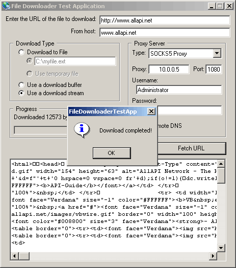



## FileDownloader

### Description

With this easy to use class file, you can download files asynchronously from an HTTP server. It also supports normal proxies, SOCKS4/5 proxies and resume downloads.
 
### More Info
 

             |
---                |---
**Submitted On**   |2001-11-12 01:24:54
**By**             |[Pieter Philippaerts](https://github.com/Planet-Source-Code/PSCIndex/blob/master/ByAuthor/pieter-philippaerts.md)
**Level**          |Intermediate
**User Rating**    |5.0 (30 globes from 6 users)
**Compatibility**  |VB 4\.0 \(32\-bit\), VB 5\.0, VB 6\.0
**Category**       |[Internet/ HTML](https://github.com/Planet-Source-Code/PSCIndex/blob/master/ByCategory/internet-html__1-34.md)
**World**          |[Visual Basic](https://github.com/Planet-Source-Code/PSCIndex/blob/master/ByWorld/visual-basic.md)
**Archive File**   |[FileDownlo3459611112001\.zip](https://github.com/Planet-Source-Code/pieter-philippaerts-filedownloader__1-28641/archive/master.zip)

